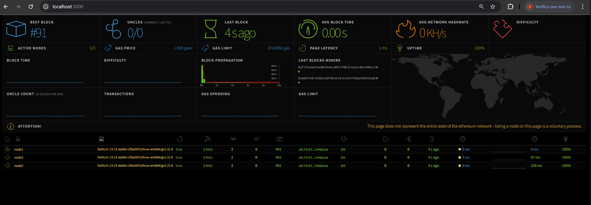

# DLT-based Service Federation — DESIRE6G Project

This repository contains the source code for the **DLT-based Federation** module, part of the **Service Management and Orchestration (SMO)** component developed within the scope of the [DESIRE6G](https://desire6g.eu/) project.

**Author:** Adam Zahir Rodriguez  

---

## 🚀 Deployment guide

### Build the images

To build the required Docker images, navigate to the [dockerfiles](./dockerfiles) directory:

```bash
git clone git@github.com:adamzr2000/d6g-dlt-federation.git
cd d6g-dlt-federation/dockerfiles
```

Run the `./build.sh` scripts for each submodule:

| Module                 | Description                                                                                                     | Status       |
|------------------------|-----------------------------------------------------------------------------------------------------------------|--------------|
| **blockchain-node**    | Ethereum node image using [Go-Ethereum (Geth)](https://geth.ethereum.org/docs) for private blockchain deployment ([details](./dockerfiles/blockchain-node/))                                                                            | ✅ Available |
| **blockchain-manager** | REST API built with [FastAPI](https://github.com/fastapi/fastapi) and [Web3.py](https://web3py.readthedocs.io/en/stable/) to interact with the `Federation Smart Contract` ([details](./dockerfiles/blockchain-manager/))               | ✅ Available |
| **truffle**            | Development environment based on [Truffle](https://archive.trufflesuite.com/docs/truffle/) for compiling and deploying the [Federation Smart Contract](./smart-contracts/contracts/Federation.sol). ([details](./dockerfiles/truffle/)) | ✅ Available |
| **eth-netstats**       | Lightweight Ethereum network monitoring dashboard ([details](./dockerfiles/eth-netstats/))                                                                                                                                              | ✅ Available |


---

### Deploy the blockchain network (distributed)

This setup creates a basic 3-node private Ethereum network distributed across separate SMO machines (illustrating `domain1`, `domain2`, and `domain3`).

### 🟩 `domain1` — bootstrap node

*domain1* must be deployed first and is responsible for:

- **Bootnode** — Acts as the entry point and discovery service, allowing other nodes to join and connect automatically.
- **Validator node** — Participates in the consensus protocol and maintains a synchronized copy of the distributed ledger.
- **Monitoring dashboard** — Runs Ethereum network monitoring dahsboard.

### 🟨 `domain2` and `domain3` — joining nodes

Each of these domains runs:

- A **validator node** that connects to the network through the bootnode hosted in `domain1`.

### Steps

> ℹ️ Note: Before deploying make sure you update the 'IP_ADDR', 'BOOTNODE_IP', 'NETSTATS_IP' environment variables in the following files with the actual IP address of each respective SMO machine:
- [bootnode.env](./blockchain-network/geth-poa/bootnode.env)
- [domain1.env](./blockchain-network/geth-poa/domain1.env)
- [domain2.env](./blockchain-network/geth-poa/domain2.env)
- [domain3.env](./blockchain-network/geth-poa/domain3.env)

1. Initialize the network on `domain1`:

```bash
./start_geth_net.sh --file domain1-geth-network.yml
```

📊 Network dashboard: [http://localhost:3000](http://localhost:3000)




2. Join `domain2` to the network:

```bash
./start_geth_net.sh --file domain2-geth-network.yml
```

2. Join `domain3` to the network:

```bash
./start_geth_net.sh --file domain3-geth-network.yml
```

> ℹ️ Note: To add or remove validator nodes, follow the steps outlined in the [blockchain-network](./blockchain-network/geth-poa) directory

### Deploy the blockchain network (local)

A local deployment option is also provided for development and debugging purposes using the [local-geth-network.yml](./blockchain-network/geth-poa/local-geth-network.yml) Docker Compose file on a single host.

To start the local Ethereum network:

```bash
./start_geth_net.sh --file local-geth-network.yml
```

---

### Deploy the Federation Smart Contract

To deploy the [Federation Smart Contract](./smart-contracts/contracts/Federation.sol) on the blockchain network:

```bash
./deploy_smart_contract.sh --node-ip 127.0.0.1 --port 3334
```

> ℹ️ Note: The smart contract can be deployed from any participating node in the network

---

### Deploy the blockchain manager

```bash
# Domain1
./start_blockchain_manager.sh --config blockchain-network/geth-poa/domain1.env --domain-function consumer --port 8080

# Domain2
./start_blockchain_manager.sh --config blockchain-network/geth-poa/domain2.env --domain-function provider --port 8080

# Domain3
./start_blockchain_manager.sh --config blockchain-network/geth-poa/domain3.env --domain-function provider --port 8080
```

📚 FastAPI Docs: [http://localhost:8080/docs](http://localhost:8080/docs)

### API endpoints

### Web3 Info
```bash
FED_API="localhost:8080"
curl -X 'GET' "http://$FED_API/web3_info" | jq
```

Returns `web3_info` details; otherwise returns an error message.

---

### Transaction Receipt
```bash
TX_HASH="0x123…"
curl -X GET "http://$FED_API/tx_receipt?tx_hash=$TX_HASH" | jq
```

Returns `tx-receipt` details for a specified `tx_hash`; otherwise returns an error message.

---

### Register Domain
```bash
curl -X POST "http://$FED_API/register_domain" -H 'Content-Type: application/json' -d '{"name": "<domain_name>"}' | jq
```

Returns the `tx_hash`; otherwise returns an error message.

---

### Unregister Domain

```bash
curl -X DELETE "http://$FED_API/unregister_domain" | jq
```

Returns the `tx_hash`; otherwise returns an error message.

---

### Create Service Announcement
```bash
curl -X POST "http://$FED_API/create_service_announcement" \
-H 'Content-Type: application/json' \
-d '{
   "service_type": "K8s App Deployment",
   "bandwidth_gbps": 0.1,
   "rtt_latency_ms": 20,
   "compute_cpus": 2,
   "compute_ram_gb": 4
}' | jq
```

Returns the `tx_hash` and `service_id` for federation; otherwise returns an error message.

---

### Check Service Announcements
```bash
curl -X GET "http://$FED_API/service_announcements" | jq
```

Returns `announcements` details; otherwise, returns an error message.

---

### Place Bid
```bash
curl -X POST "http://$FED_API/place_bid" \
-H 'Content-Type: application/json' \
-d '{"service_id": "<id>", "service_price": 5}' | jq
```

Returns the `tx_hash`; otherwise returns an error message.

---

### Check Bids
```bash
curl -X GET "http://$FED_API/bids?service_id=<id>" | jq
```

Returns `bids` details; otherwise returns an error message.

---

### Choose Provider
```bash
curl -X POST "http://$FED_API/choose_provider" \
-H 'Content-Type: application/json' \
-d '{"bid_index": 0, "service_id": "<id>"}' | jq
``` 

Returns the `tx_hash`; otherwise returns an error message.

---

### Send Endpoint Info
```bash
curl -X POST "http://$FED_API/send_endpoint_info" \
-H 'Content-Type: application/json' \
-d '{
   "service_id": "<id>", 
   "service_catalog_db": "http://10.5.15.55:5000/catalog",
   "topology_db": "http://10.5.15.55:5000/topology",
   "nsd_id": "ros-app.yaml",
   "ns_id": "ros-service-consumer"
}' | jq
``` 

Returns the `tx_hash`; otherwise returns an error message.

---

### Check if the calling provider is the winner
```bash
curl -X GET "http://$FED_API/is_winner?service_id=<id>" | jq
```

Returns the `is_winner`, which can be `yes`, or `no`; otherwise, returns an error message.

---

### Send Endpoint Info
```bash
curl -X POST "http://$FED_API/send_endpoint_info" \
-H 'Content-Type: application/json' \
-d '{
   "service_id": "<id>", 
   "topology_db": "http://10.5.15.56:5000/topology",
   "ns_id": "ros-service-provider"
}' | jq
``` 

Returns the `tx_hash`; otherwise returns an error message.

---

### Confirm Service Deployment
```bash
curl -X POST "http://$FED_API/service_deployed" \
-H 'Content-Type: application/json' \
-d '{
   "service_id": "<id>",
   "federated_host": "10.0.0.10"
}' | jq
```

Returns the `tx_hash`; otherwise returns an error message.

---

### Check Service State
```bash
curl -X GET "http://$FED_API/service_state?service_id=<id>" | jq
```

Returns the `state` of the federated service, which can be `open`,`closed`, or `deployed`; otherwise, returns an error message.

---

### Check Deployed Info
```bash
curl -X GET "http://$FED_API/service_info?service_id=<id>" | jq
```

Returns the `federated_host` (IP address of the deployed service) along with either `endpoint_consumer` or `endpoint_provider` details; otherwise, returns an error message.

---

### Event Subscriptions

Follow these steps to receive live notifications whenever a new smart‑contract event is emitted:

1. Start the callback listener
```bash
cd utils
python3 callback_receiver.py
```

It consists of a simple Flask server app running on port `9000` that receives the incoming event notifications at `/callback` and print them to the console.

2. Create a subscription to the event you care about and where to deliver
```bash
CALLBACK_URL="http://localhost:9000/callback"
curl -X POST "http://$FED_API/subscriptions" -H "Content-Type: application/json" -d '{"event_name": "ServiceAnnouncement","callback_url": "'"$CALLBACK_URL"'"}' | jq
```

Returns your new `subscription_id`

3. List all subscriptions
```bash
curl -X GET "http://$FED_API/subscriptions" | jq
```

Returns an array of `{ subscription_id, event_name, callback_url, last_n_blocks }`


4. Delete a subscription
```bash
SUB_ID="b1dcf105e5944daea0425a7649aaee36"
curl -X DELETE "http://$FED_API/subscriptions/$SUB_ID"
```

Returns HTTP 204 on success; the subscription is removed.