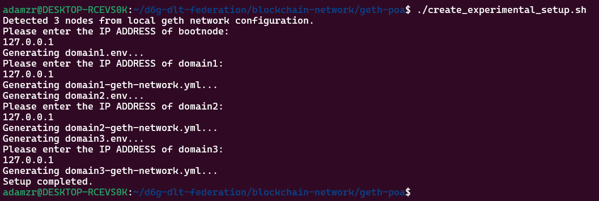

# Geth POA Network Setup

A step-by-step toolkit to quickly create, run, and tear down your own private Ethereum network using Geth’s Proof‑of‑Authority (PoA) consensus protocol.

---

## 🚀 Quickstart (local deployment)

1. **Generate your network config**

   ```bash
   ./create_config.sh
   ```

   * **Prompts you** for:

     * **Number of nodes** (e.g. 3)
     * **Block period** (time in seconds between blocks, e.g. 5)
     * **Chain ID** (unique network ID, e.g. 1337)
     * **Log saving** (yes/no)
   * **Outputs**:

     * `config/` folder with:

       * **Node folders** (each has keystore, password.txt, start\_node.sh)
       * **bootnode key** (`config/bootnode/boot.key`)
       * **genesis.json** (defines chain parameters)
     * **.env** (environment variables with all addresses/ports)
     * **local-geth-network.yml** (Docker Compose file)

2. **Start the network**

   ```bash
   ./start_geth_net.sh --file local-geth-network.yml
   ```

   * **Brings up**:

     * **Bootnode**: helps nodes discover each other.
     * **Geth nodes**: your validators running in Clique POA mode.
     * **eth-netstats** (optional): web dashboard at `http://<your_host>:<ETH_NETSTATS_PORT>`.

3. **Stop & tear down**

   ```bash
   sudo ./stop_geth_net.sh --file local-geth-network.yml
   ```

   * Stops all containers and removes them.

4. **Clean up configuration**

   ```bash
   ./delete_config.sh
   ```

   * **Deletes** `config/`, `.env`, and `*.yml` files to start fresh.

---

## 🔬 Advanced & Experimental

* **Multi‑domain setup**: Run the geth nodes in separate hosts

  1. Generate per-domain configuration:

     ```bash
     ./create_experimental_setup.sh
     ```



  2. Clean up configuration:

     ```bash
     ./delete_experimental_setup.sh
     ```

  Each domain gets its own `.env` and Compose file.